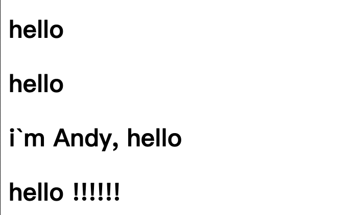

# v-text 
设置标签的文本值
相当于`innerText`

### v-text = "message"
但是会替换所有内容

### 插值表达式 {{message}}
仅大括号内部被替换



```html
<div id="app">
        <h2 v-text='message'>i was content</h2>
        <h2>{{message}}</h2>
    </div>
    <script>
        var app = new Vue({
            el: "#app",
            data: {
                message: "hello"
            }
        })
    </script>
```
---
插值表达式可以写表达式
还可以拼接字符串
```html
    <div id="app">
        <h2 v-text='message + "??"'></h2>  
        <h2>i`m Andy, {{message}}</h2>
        <h2>{{message + " !!!!!!"}}</h2>
    </div>
    <script>
        var app = new Vue({
            el: "#app",
            data: {
                message: "hello"
            }
        })
    </script>
```