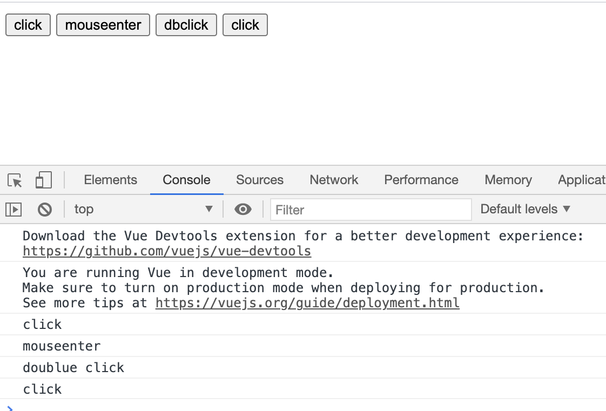
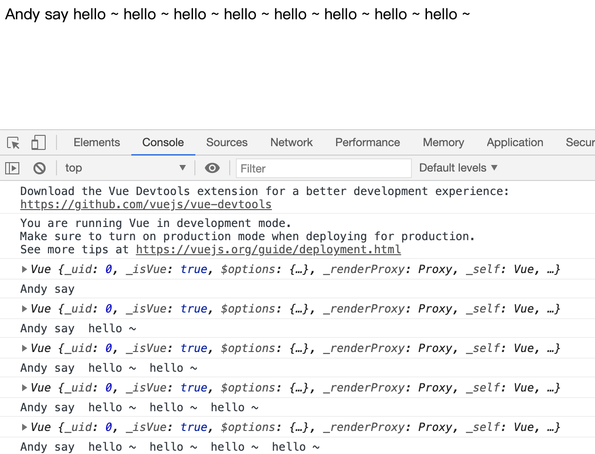

# methods属性  v-on
给元素绑定事件

## Vue事件的声明 与 绑定
### 1. methods属性
在Vue实例对象的 methods属性中定义要绑定给元素的方法
```js
var app = new Vue({
    rel: 选择器,
    methods:{
        方法名:function(){},
        方法名:function(){},
        方法名:function(){}
    }
})
```

### 2. v-on 绑定事件
``` js
v-on:事件类型=“methods中的方法名”
```
```html
<button v-on:click="sayHello">click</button>
```
---
### 简写为 @
```js
@事件类型=“methods中的方法名”
```
``` html
<button @click="sayHello">click</button>
```


```html
<div id="app">
        <button v-on:click="sayClick">click</button>
        <button v-on:mouseenter="sayMouseenter">mouseenter</button>
        <button v-on:dblclick="saydblClick">dbclick</button>

        <button @click="sayClick">click</button>
    </div>

    <script>
        var app = new Vue({
            el: '#app',
            methods: {
                sayClick: function() {
                    console.log('click');
                },
                sayMouseenter: function() {
                    console.log('mouseenter');
                },
                saydblClick: function() {
                    console.log('doublue click');
                }
            }
        })
    </script>
```


## this
Vue是通过实例化Vue对象后使用该实例对象的方法和属性，
所以this在Vue中指向Vue对象
```html
    <div id="app">
        <p @click='sayHello'>{{content}}</p>
    </div>

    <script>
        var app = new Vue({
            el: '#app',
            data: {
                content: 'Andy say '
            },
            methods: {
                sayHello: function() {
                    console.log(this);
                    console.log(this.content);

                    this.content += ' hello ~ '
                }
            }
        })
    </script>
```
