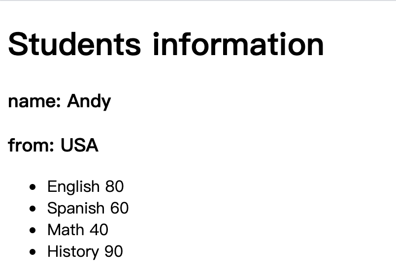

# data 属性
```js
var app = new Vue({
    el: 选择器，
    data: {
        text，
        array，
        object...
    }
})
```

- Vue的数据都定义在data属性中

- data中可以写入复杂数据类型

- 渲染复杂类型数据到页面DOM元素中时，遵守JS语法即可
比如：`obj.params` 、`array[index]`...
 





```js
var app = new Vue({
    el: '#app',
    data: {
        //简单文本
        message: 'Students information',
        //对象
        info: {
            name: 'Andy',
            country: "USA"
        },
        //数组
        lesson: ['English', 'Spanish', 'Math','History'],
        score: [80, 60, 40, 90]
    }
})
```
```html
  <div id="app">
        <h1>{{message}}</h1>
        <h3>
            name: {{info.name}}
        </h3>
        <h3>
            from: {{info.country}}
        </h3>
        <ul>
            <li>{{lesson[0]}} <span> {{score[0]}}</span> </li>
            <li>{{lesson[1]}} <span> {{score[1]}}</span> </li>
            <li>{{lesson[2]}} <span> {{score[2]}}</span> </li>
            <li>{{lesson[3]}} <span> {{score[3]}}</span> </li>
        </ul>
    </div>
```