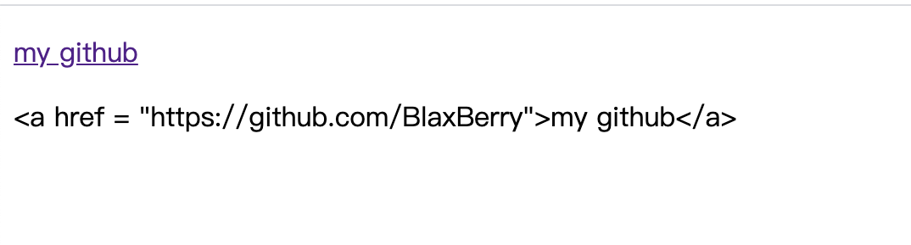

# v-html
设置元素内容
相当于 `innerHTML`

普通文本时，和v-text一样效果

若是html结构，则解析为html标签


```html
    <div id="app">
        <p v-html="content"></p>
        <p v-text="content"></p>
    </div>

    <script>
        var app = new Vue({
            el: '#app',
            data: {
                content: 'hello'
            }
        })
    </script>
```