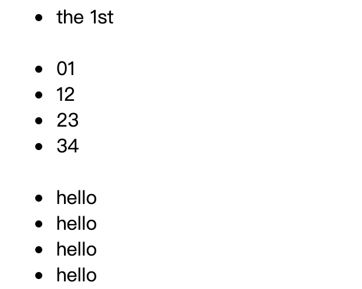

```html
        <ul>

            <li> the 1st</li>
           
            <li v-for="(item,index) in arr">
                <span>{{index}}</span><span>{{item}}</span>
            </li>
            
            <li v-for="item in arr">
                <span>hello</span>
            </li>

        </ul>
```
```js
var app = new Vue({
            el: "#app",
            data: {
                arr: [1, 2, 3, 4]
            }
        })
```