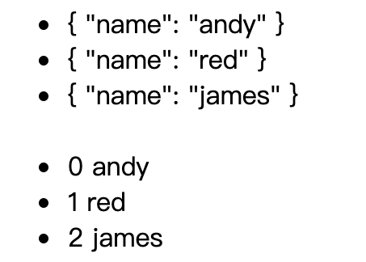

```html
       <ul>
            <li v-for="item in arr">{{item}}</li>
            
            <li v-for="(item,index) in arr">
                <span>{{index}}</span> <span>{{item.name}}</span>
            </li>

        </ul>
```
```js
 var app = new Vue({
            el: "#app",
            data: {
                arr: [{
                    name: 'andy'
                }, {
                    name: 'red'
                }, {
                    name: 'james'
                }]
            }
```