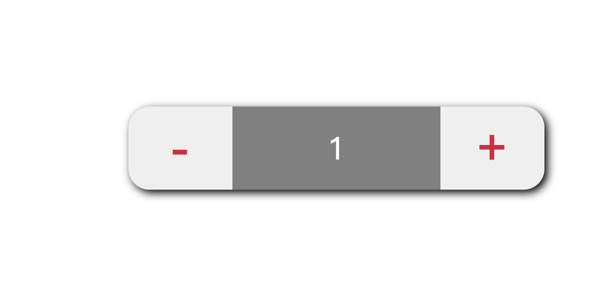

# Vue 实现 网页计时器效果


---
1. data 中定义数据 num

2. methods 中定义方法： add（+）和 sub（-）

3. num>0,可以递减
4. num<0，可以递加

5. v-text 把num设置给元素

6. v-on 把事件绑定元素


```html
        <div class="main">
            <button @click="sub">-</button>
            <span>{{num}}</span>
            <button @click="add">+</button>
        </div>
```
```js
         methods: {
                add: function() {
                    if (this.num < 10) {
                        this.num++
                    } else {
                        alert('error\nmust smaller than 10')
                    }
                },
                sub: function() {
                    if (this.num > 0) {
                        this.num--
                    } else {
                        alert('error\nmust bigger than 0')
                    }
                }
        }
```