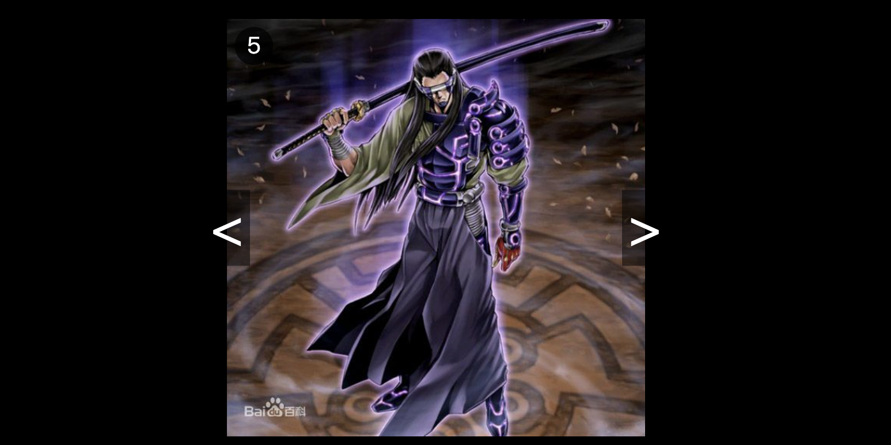

# Vue 实现图片切换

not write in html 
put src of Images in a Array
use v-bind:src = arr[index]



```html
<div id="app">
        
        <div class="left" @click="prev">&lt;</div>
        <div class="right" @click="next">&gt;</div>
</div>
```

```js
var app = new Vue({
        el: "#app",
        data: {
            srcArry: [],
            index: 0,
        },
        methods: {
            prev: function() {
                
            },
            next: function() {}
        }
    })
```

