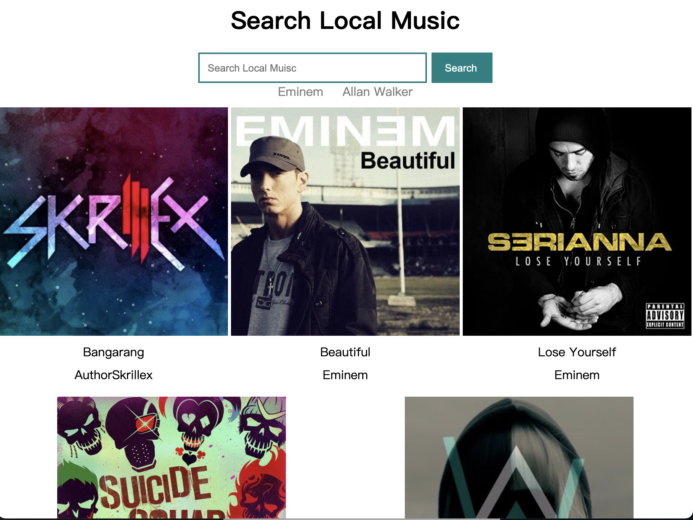

# Music Searching Demo

## 使用
- less 
- flex box 
- Vue
- axios

---
## 功能
1. 表单搜索框直接输入查询
2. 点击关键字搜索
3. 点击按钮搜索


---
## Question
### 数据的获得
没有接口文件，只能自己写了一个 `.json`文件

数组嵌套对象的形式储存了几组歌曲信息

导致了 get方法只能获得全部的数据

不能实现搜索指定的歌曲
```js
axios.get(`UL?name=`${this.inputmessage})
```
