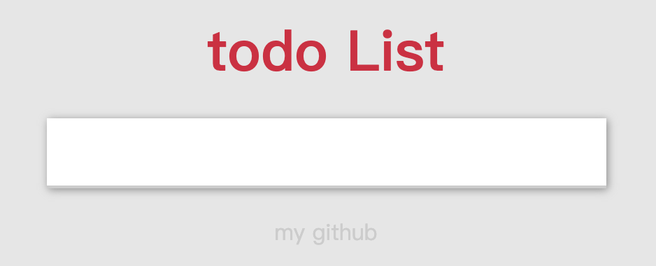

# Vue 实现 todoList


## create List Item 新增

## remove list Item 删除

## Total Amount of Items 统计数量

## clear all Tiems 清空

## hide footer box 隐藏

```js
 methods: {
        // add list
        add: function() {
            if (this.message !== '') {
                this.arr.push(this.message);
                this.message = '';
            }
        },

        // remove list by a tag
        remove: function(index) {
            this.arr.splice(index, 1);
        },
        
        //clear all items
        clearAll: function() {
            this.arr = [];
        }
    }
```